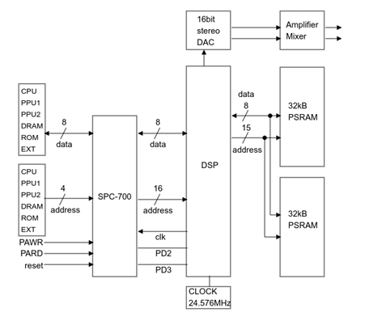

# SNESDRONE - Wavetable Audio Synthesizer Cartridge for a Gaming Console

## ARM-based ROM emulation for a 16-bit gaming console in order to use its internal wavetable synthesizer chip as a musical instrument

Michael Hirschmugl

Audio Engineering Project, Institute of Electronics, Technical University Graz

February 2020

## Abstract
The SNES (or Super Famicom) is widely considered as one of the greatest gaming consoles of all time. Even though its games had fantastic soundtracks, it's not too well known, that the console actually used a sort of wavetable synthesis chip by Sony for this. This chip is based on the technology of iconic synthesizers from the 1980s such as the Korg Wavestation. Together with the DSP technology by Sony, the console can produce eight stereo channels of sample-based synthesis, one noise channel, has ADSR envelope controls and even echo, filtering and modulation effects.
The goal of this project is to make use of this chip and to turn the console into a standalone synthesizer, but without modifying the console itself. A synthesizer cartridge, that everyone with a console can use, is needed.

## List Of Abbreviations

| Abbreviation | Description                         |
|--------------|-------------------------------------|
| SNES         | Super Nintendo Entertainment System |
| MPU          | Microprocessor Unit                 |
| CPU          | Central Processing Unit             |
| ROM          | Read-Only Memory                    |
| RAM          | Random Access Memory                |
| PSRAM        | Pseudostatic RAM                    |
| ARM          | Advanced RISC Machine               |
| RISC         | Reduced Instruction Set Computer    |
| CISC         | Complex Instruction Set Computer    |
| SoC          | System on Chip                      |
| DMA          | Direct Memory Access                |
| PPU          | Picture Processing Unit             |
| APU          | Audio Processing Unit               |
| IC           | Integrated Circuit                  |
| BRR          | Bit Rate Reduction                  |
| GUI          | Graphical User Interface            |
| VBLANK       | Vertical Blank                      |
| ADSR         | Attack Decay Sustain Release        |

## Table of Contents
1  Introduction

1.1  Project Goals and Motivation

1.2  Wavetable Synthesis

1.3  SNES Hardware

1.3.1  General Overview

1.3.2  CPU – Central Processing Unit

1.3.2.1  Bus Transfer Timing Diagram

1.3.3  PPU – Picture Processing Unit

1.3.3.1  V-BLANK – Vertical Blank

1.3.3.2  Character and Palette Format

1.3.4  APU – Audio Processing Unit

1.3.4.1  SPC-700

1.3.4.2  The DSP

1.3.4.3  Functionality and Block Diagram

1.3.4.4  Bit Rate Reduction Audio Format (BRR)

2  Cartridge Hardware Development

2.1  Microcontroller

2.2  Connection between console and microcontroller

2.3  Potentiometers and other peripherals

2.4  Power supply

3  Firmware Development

3.1  Overview

3.2  Setting up a Development Environment

3.2.1  Setting up WLA DX

3.2.2  Setting up bsnes plus

3.3  SNES Software

3.3.1  Initializing Internal Hardware

3.3.2  Enabling the Graphical User Interface

3.3.3  Waiting for SPC-700 Boot

3.3.4  Writing Samples to APU Memory

3.4  ARM µC Firmware

4  Conclusion and Outlook

# 1 Introduction
While wavetable synthesis has been around since the early 1980s, with the advent of software based audio synthesizers, it is rarely based on hardware anymore. Still, to comprehend and apply the underlying algorithms, it is useful to realize a wavetable synthesizer for audio applications on dedicated hardware. The Super Nintendo Entertainment System (SNES) is a gaming console which surfaced in 1990 and uses one such chip, as well as a derivative of the WD65816 MPU (microprocessor unit) as a CPU (central processing unit), which is one of the first MPUs to work with an 16-bit arithmetic logic unit (ALU) and other bedrock features still used in today’s modern platforms.
In the course of this project, a wavetable synthesizer for audio applications was developed, which utilizes the digital signal processing chip of the SNES for sound generation. This was achieved by building hardware that connects through the cartridge slot of the console directly to the internal CPU. Since the console has no built-in program memory, instructions for games were usually provided through an external ROM (read-only memory) to the CPU. In this project, the ROM chip is simulated with an ARM (advanced RISC machine) based microcontroller.
This documentation will begin by developing the idea and motivation for this project and cover all development steps, background knowledge regarding digital sound synthesis in general as well as fundamental microprocessor concepts. Since there is outdated computing hardware used in this project, there will also be some chapters covering older subjects of computer and video game science, which is very helpful in developing profound understanding of modern microprocessor architectures.

## 1.1 Project Goals and Motivation
A basic idea for this project was to extend and enhance old computing hardware. The Super Nintendo Entertainment System relied heavily on the computing power of the main CPU, but frequently used special ICs (integrated circuit) in the attached cartridges to relief the CPU with parallel math computations, besides from providing the instruction memory itself. These chips are called “co-processors” and are still a fairly prevalent concept in today’s microcontroller architectures (e.g. floating point units or filtering co-processors).
Since the advancements in microprocessor technologies during the last three decades has created microprocessors that are many times more powerful than in the 1990s, it should be possible to augment the capabilities of an old gaming console to a very high degree by using a modern co-processor. Hence, the idea was born to use a powerful ARM based microcontroller as a co-processor for the SNES’ internal CPU.
While many different use cases are imaginable for an ARM microcontroller used as co-processor, a focused usage had to be found, and while 8-bit gaming consoles are often used in musical performances in the so-called “chip tune” genre, the vast audio possibilities of 16-bit consoles (such as the SNES) is mostly untouched.
The SNES’ audio processing unit provides some highly advantageous capabilities compared to other consoles. Not only does it consist of eight stereo channels of sample-based digital synthesis, but it even offers high resolution audio playback as well as effects and modulation between channels.

The project goals are listed in order of chronologically achieved milestones:
- Development of a SNES compatible cartridge that hosts an ARM µC which connects to the console’s internal address and data buses
  - Power for the ARM µC should be provided through the cartridge slot (no need for additional power supply)
  - Logic level voltage shifting from 5V to 3,3V (and vice-versa) for data signal lines
- Simulation of external Read Only Memory as instruction storage for the console’s CPU
  - Reading of 24-bit addresses by the µC
  - Reading and writing 8-bit data by the µC
- Providing designated internal memory from µC to console CPU
- Development of Software that is executed by the console’s CPU
  - Control the audio DSP chip
  - Supply digital audio data to the synthesizer chip
  - Generate video data for a graphical user interface (displayed on additional TV hardware)
  - Processing of provided analog data from potentiometers to derive updated sound and video display

##  1.2 Wavetable Synthesis
Wavetable synthesis in its most basic form is the continuous repetition of a single digital audio sample [1]. This concept should not be confused with sample-based synthesis. While all wavetable oscillators are indeed sample based, not all sample based-synthesizers may be called wavetable synthesizer [2]. This is because wavetable synthesis also provides features for shifting between different waves in a table. This concept is displayed in figure 1. While the highlighted triangular function is the fundamental signal for this wavetable oscillation, it is possible to gradually shift to a sine or saw tooth function by LFO modulation or simply manually. This yields the possibility of automated manipulations of the frequency spectrum and can be viewed as a form of additive synthesis.


*Figure 1: Visualization of a software wavetable synthesizer* [Screenshot taken from Arturia “Pigments” (polychromatic software synthesizer). Copyright 2020 by Arturia. Visit Arturia at https://www.arturia.com/]

In a wavetable oscillator, the signal data is not procedurally generated by a mathematical function, but rather fetched from a table of stored values (figure 2). A differentiation must be established here, because while there is a table of different waveforms (wavetable), there is also a table of values for each waveform (look-up table).


Figure 2: Example look-up table waveform [“Wellenformtabelle mit Sinus” from “Klangsynthese 1” (f. 3.8, p. 37) by W. Ritsch, 2010, Institute of Electronic Music and Acoustics]

The pitch shift in a wavetable synthesizer is accomplished by reading the sample data with different step sizes. A higher step size will result in a higher pitch. While this is a very simple and effective method for pitch shifting, special attention has to be paid to musical timbre, since harmonics are also shifted with the base frequency of a sample [3].
Equation 1 shows a mathematical representation of an algorithm that fetches signal values from a look-up table in regard of the desired pitch or frequency.

*Equation 1*

$$
y(n) = A(n) \cdot \text{table}\left[\text{round}(S(n))\right]
$$

$$
S(n+1) = [S(n) + I(n)] \, \text{mod}(L)
$$

$$
I(n) = f(n) \cdot \frac{L}{R}
$$

y...output signal
A...Amplitude
n...time in sample
L...table length
S...table position
R...sample rate
f()...oscillation frequency
I(n)...Increment function

Since the step size increases with desired pitch, there are two more issues which have to be taken into account: Aliasing and Interpolation. Aliasing occurs when the step size is larger than half of the original waveform’s frequency and interpolation is needed between subsequent samples in order to prevent higher frequency content generation from quantization steps. While interpolation is most likely performed within the synthesis DSP, aliasing has to be controlled by the programmer.

## 1.3 SNES Hardware
While modern gaming consoles mostly use SoC (System-on-Chip) designs based on ARM processing cores, or simply PC-like hardware with a customized operating system, consoles like the SNES were built from various different integrated circuits. Each IC with its unique purpose and controlled from one central processing unit. Like many other consoles from this era, the SNES also did not host any static internal program memory, but rather had instructions as well as data provided through an external slot, also known as a cartridge slot. Such a cartridge would mainly consist of a ROM chip which connected directly to the CPU’s address and data bus (main system bus). Some cartridges would also utilize additional RAM or even co-processors. This chapter will establish basic understanding of the inner workings of the SNES.

### 1.3.1 General Overview
Figure 3 shows the block diagram of the SNES. The whole assembly consists of a CPU and RAM, a Picture Processing Unit (PPU) to generate analog video signals and an Audio Processing Unit (APU) for music and sound effects. The main three buses that link all the individual components together are the two address buses A (24 bit) and B (8 bit), as well as the data bus (8 bit). While address bus A is the main form of transfer between the individual parts, address bus B is used for DMA operations in smaller memory regions. Instructions and data are provided as ROM through the cartridge slot and other peripheral components (Joy-pad Slots, Region Lockout Logic,…) are directly wired to the CPU.


*Figure 3: SNES Architecture Overview*

The 5A22 CPU maps all internal registers and all peripheral components on a single memory space of 24 bit. This means, that data transfer to and from ROM works in the same way as manipulation of internal registers, by writing or reading to or from addresses in a 24-bit memory space.


*Figure 4: Typical cartridge layout* [“Snes Cartucho Esquematico” by “Deltablade2005” (original work), released on july 25th 2018 under Creative Commons Attribution-Share Alike 4.0 International license.]

Figure 4 shows a typical cartridge layout as intended by Nintendo. As can be seen, there are only few passive components on a cartridge, and these are mainly used for power supply control and regulation. The chip called D411A is the region lockout chip, which connects directly to the region lockout logic in the console and is otherwise detached from the rest of the circuits in the cartridge. The big IC on the right is the ROM which also has an additional address decoder (74LS139A) that can be used to expand or shift memory space to a specific region. In the upper right is additional RAM to store safe states or simply to expand the console’s internal RAM.

### 1.3.2 CPU - Central Processing Unit
The CPU1 in the SNES is the Ricoh 5A22 microprocessor (figure 5) which is clocked at 21.28137MHz (for PAL operation). With the 65C816 core, it is based on the MOS Technology 6502 family of processors, but contains a variety of support hardware. Most prominent, a controller port interface to access serial data from the joy-pad controllers. There is also circuitry for generating non-maskable and maskable interrupts, a DMA unit for fast memory transfer and a couple of registers for multiplication and division. The 65C816 core has a 16-bit internal bus architecture with an 8-bit external databus and 24-bit external data bus [4].


*Figure 5: Ricoh 5A22 CPU* [“Ricoh 5A22” by “Yaca2671” (original work), released on april 10th 2007 under Attribution-ShareAlike 3.0 Unported license.]

Instructions are 1-byte opcodes followed by 0-3 byte operands and are actually very similar to RISC instructions in regards of complexity, even though, the 65C816 core is more closely related to a CISC architecture. The big difference to a RISC processor are the numerous addressing modes, which is a distinct feature of a CISC core.
The CPU has an internal oscillator to produce all required clocks. To access different areas of the memory map, there are three different frequencies available, which define the access speed of the accessed component. An internal operation takes 6 master cycles, while a memory access routine takes 6, 8, or 12 master cycles, depending on the memory region accessed and the status of the "FastROM select"-bit in register 0x420Dh (MEMSEL). By default, ROM access takes 8 cycles, but if this bit is set, a ROM access (via banks 0x80h-0xFFh) can be performed in only 6 cycles. Memory from 0x4000h to 0x41FFh (on all banks) takes 12 cycles. The concept of memory banks will be discussed in chapter 3.3 SNES Software.

#### 1.3.2.1 Bus Transfer Timing Diagram
With a modified SNES console, I was able to use a logic analyzer to record the data transfer between cartridge and console. Figures 6 and 7 show the results of these measurements.
Top to bottom, the graph in figure 6 shows the following signals on the system bus: The clock output of the 5A22 CPU, the signals “read”, “write” and “ROM select” (which will be described immediately), an interrupt request signal and the two buses for addresses (24-bit address bus A) and data (8-bit data bus).
The “read” signal is used by the processor whenever it tries to access data that is stored in a readable area of the memory map. For instance, fetching an instruction from ROM memory would set the “read” signal and also the “ROM select” signal. This way, the memory chip in the cartridge is activated and will produce data on the data bus, corresponding to the address on the address bus.


*Figure 6: General Bus Transfer Timing
Signals top to bottom: Clock (CLK), Read (RD), Write (WR), ROM select, Interrupt Request (IR), contents of the address bus and the contents of the data bus.*

**Reading of initial instructions after reset:**
Figure 7 displays such a read from ROM. This procedure is actually the very first read from ROM after supplying power to the CPU. It fetches an address from a hard coded reset vector location, which specifies, where the first instruction is located in ROM and proceeds with execution from this location on.

**Access timing:**
As can be seen in the figures, the first address accessed is `0x00:FFFCh` (reset vector). The LSB at this location is `0x00h`, which is read on the fall of the clock (at the timer mark 1 in green). From this clock fall on, it takes 50ns until the next address (`0x00:FFFDh`) is ready on the bus. While the signal “read” goes low, the ROM fetches the MSB of the reset vector which is `0x80h` in this example. This byte is read by the processor on the next clock fall, which is about 400ns after the previous clock fall. This duration of time corresponds roughly to a frequency of 2,68MHz, which is the documented speed for ROM access.


*Figure 7: ROM Read Timing*

In the beginning of this project, an idea to emulate a ROM chip was to generate an interrupt signal in the ARM microcontroller on every clock fall. Quick measurements revealed though, that the shortest latency for any reaction by the ARM MCU (after an external interrupt) would be about 150ns. Which isn’t a lot, but still too slow for any additional logic, to provide the SNES’ CPU with valuable data. Based on the result, the firmware relies heavily on polling, which ties the MCU core completely up, but works much faster than external interrupts.

### 1.3.3 PPU - Picture Processing Unit
While the picture processing unit doesn’t have too much importance in this project, it is still used for a graphical user interface (GUI) and therefore some concepts of video signal generation have to be laid out. This chapter will also introduce the main source of timing in the SNES – the so called Vertical Blank (v-blank).

#### 1.3.3.1 V-BLANK - Vertical Blank
A video game console such as the SNES originally uses cathode ray tube (CRT) monitors to display images on a screen. These types of monitors work similarly to an oscilloscope screen, by focusing an electron beam at a phosphorescent screen, causing it to light up a point. The beam can be bent by a magnetic field to change the point that lights up. By moving the beam really fast back and forth an entire image can be displayed.
The pattern the beam traces out on the screen is displayed in figure 8, while there are many more scan lines than shown in this graphic. At the end of one frame, the beam reaches the bottom right corner of the screen and has to move back up again. During this amount of time, the beam is turned off (blanked), which gives this period the name “vertical blank”, or v-blank for short.


*Figure 8: Illustration of raster scanning* ["Illustration of raster scanning" by Ian Harvey (original work), released on november 1st 2018 under Public Domain.]

In the PAL standard, frames are displayed at a frequency of 50Hz. To get a sense of time scale, this frequency means that a frame is 20ms long, while the v-blank period is  4.68ms in duration, which already takes up 23.4% of the entire frame.
From the start of a frame, until the start of v-blank, the image is drawn from data that is stored in PPU RAM and from configurations in PPU registers. During this process, the data in PPU RAM must not be changed since this could cause artifacts in the resulting image. This leaves 15.32ms for computations and most importantly, for communications with the cartridge or in this case, the external MCU. The image data can only be changed during the period of v-blank when the electron beam is turned off.

#### 1.3.3.2 Character and Palette Format
**Palettes:** Color palettes are stored in 15-bit BGR format. Each color word is 2 bytes in size and the format looks like this:
```
0BBBBBG	GGGGRRRRR
MSB	LSB
```
**Characters:** A frame is drawn completely from so called “characters”. A single character can be seen as a small image tile of either 8x8, 16x16, 32x32 or 64x64 pixels. The video RAM is filled with data for individual characters and a tile map then defines where these characters are displayed on the screen.
**Backgrounds:** When a tile map defines where a character is going to land on the screen, what it actually defines is where the tile is going to be displayed on one of four background layers. The PPU is capable of working with up to four individual image (or background) layers that can be moved, rotated, shifted and transformed. The maximum amount of background layers depends on several configurations such as color depth or resolution.

### 1.3.4 APU - Audio Processing Unit
The audio processing unit (APU) of the SNES consists of three main parts: The digital signal processor (DSP) that actually generates all sounds and effects, the analog signal processing for amplification and mixing of different audio streams and an additional 8-bit microprocessor with the name SPC-700.
While the DSP is responsible for digital generation of audio waveforms and the conversion of these digital streams to analog signals, the SPC-700 is practically only responsible for the control and configuration of the DSP. While this could also be done by the CPU, the SPC-700 acts as an audio co-processor. The audio RAM does not only contain sample data, but also whole arrangements of songs as series of instructions for the SPC-700. The CPU is only used to transfer arrangements through the SPC-700 into the audio RAM.



*Figure 9: APU Overview*

As we can see in Figure 9, the APU is interfacing with everything else on the SNES via the SPC-700. There's an 8-bit data bus and only a 4-bit address bus connected from the CPU to the APU. The four address lines are referred to as PA0, PA1, PA6 and PA7. These lines are not connected to the main address bus, but rather a part of the second address bus of the CPU, also known as address bus B. While signals PA0 and PA1 are used to address a total of four possible registers in the SPC-700, the signals PA6 and PA7 are actually connected to the pins CS (chip select) and /CS (chip select inverted) on the SPC-700. So the SPC is only active when CS (or rather PA6) is active, and /CS (PA7) is low. This idea is further investigated in chapter 1.3.4.1 SPC-700.

The APU of the SNES offers the following features:
- 32kHz sample rate for 16-bit stereo samples
- An 8 channel stereo ADPCM waveform generator
- 64kB RAM for BRR audio samples (equivalent to ~4 seconds of MP3 audio)
- 8-bit SPC-700 audio co-processor clocked at ~1MHz
- Two 8-bit 8kHz timers and one 8-bit 64kHz timer
- Amplitude envelope generator
- DSP hardware for echo and reverb effects, white noise, and LFO pitch modulation
- External stereo audio input

#### 1.3.4.1 SPC-700
As already established in the previous chapter, the SPC-700 is an 8-bit microprocessor that is used as  an audio co-processor in the SNES’ APU. This chip is serving two main functions: It is the interface between the main system bus and the DSP, and it executes arrangements on all eight channels of the DSP in order to perform complete musical compositions (which are stored as programs in the APU RAM).
The SPC-700 is connected to the main system bus via two address lines that correspond to the signals PA0 and PA1 on address bus B, and also the two signals PA6 and PA7 of bus B which are wired to chip select pins (“CS“ and “/CS“) of the SPC-700.
When CS is a logical 1 (high) and /CS is 0 (low), the chip will react to addresses present on the address lines, otherwise, the SPC-700 will ignore everything on the system bus. Since CS and /CS correspond to the signal PA6 and PA7 on address bus B, this leads to two possible ranges of memory banks from 0x00h to 0x3Fh and 0x80h to 0xBFh
Looking at the address bus B in regard of the 24-bit memory map as a whole, the eight address lines are mapped onto addresses 0x2100h to 0x21FFh (of banks 0x00h-0x3Fh and 0x80h-0xBFh) [5]. “Mapping” in this context means, that the values 0x00h to 0xFFh will be present on the eight physical bus (B) lines, when the CPU is instructed to access addresses from  0x2100h to 0x21FFh. This behavior is hardwired in the Ricoh 5A22.
Since the SPC-700 only uses the two address lines PA0 and PA1, there are in fact only four available addresses of internal registers that can be accessed on the SPC-700, as an interface to the main system bus and therefore the addresses (in CPU memory space) boil down to 0x2140h-0x2143h in the banks 0x80h-0xBFh (table 1). These four registers 0x2140h-0x2143h are also known as the registers “Port 0”, “Port 1”, “Port 2” and “Port 3”, and they are used to transfer data to, or from the APU.

| Banks       | SNES Address | SPC-700 Address | Name   | Remark         | Read/Write |
|-------------|--------------|-----------------|--------|----------------|------------|
| 0x80h-0xBFh | 0x2140h      | 0xF4h           | Port 0 | Status         | R/W        |
| 0x80h-0xBFh | 0x2141h      | 0xF5h           | Port 1 | Command / Data | R/W        |
| 0x80h-0xBFh | 0x2142h      | 0xF6h           | Port 2 | Address (LSB)  | R/W        |
| 0x80h-0xBFh | 0x2143h      | 0xF7h           | Port 3 | Address (MSB)  | R/W        |

*Table 1: APU communication registers*

- **Port 0 (Status):**
  - Reads 0xAAh if SPC-700 is done initializing (in combination with port 1, see below).
  - Writing 0xCCh to this port starts a transfer of one or more bytes. The address has to be ready in port 2 and port 3 at this point. The data has to be written to port 1 subsequently.
  - Reads 0xCCh if SPC-700 is ready for a transfer.
  - Writing 0x00h to this port transfers the byte in port 1 to the address in port 2 and port 3.
  - Reads 0x00h if the transfer is done.
  - To transfer another byte, the value in port 0 has to be increased by one. If the transfer is done, port 0 reads the written value back.
  - To begin another transfer to a different address, the value in port 0 is increased by 2. The new address has to be ready in port 2 and 3 at this point. If the new transfer is ready, port 0 will mirror the written value. If the value in port 0 is zero after the increase, the value has to be increased by 2 again.
  - The value in port 0 has to be non-zero to start another transfer.
  - Increasing the value in port 0 by 2 and writing it back will terminate the transfer in order to begin execution of program code for the SPC-700.

- **Port 1 (Command / Data):**
  - Reads 0xBBh if SPC-700 is done initializing (in combination with port 0).
  - Writing a non-zero value to port 1 will initialize a transfer. The address to be transferred to is written in port 2 and port 3 afterwards.
  - Holds values to be transferred.
  - To start another transfer, port 1 must not be zero.
  - Writing 0x00h to this port will end a transfer. The initial address for execution of SPC-700 instructions is specified afterwards.

- **Port 2 and Port 3 (Address):** These two ports hold the destination addresses for transfer of data in port 1. Port 2 is the lower byte and Port 3 is the upper byte of the 16-bit address.

**APU RAM memory map:**
The SPC-700 has a memory space of 16 bit (table 2), with three regions of freely usable RAM, some internal registers, mapped hardware (like the DSP) and a small region of 64 bytes which holds the IPL (initialization ROM).

| Range           | Size        | Description | Comment                             |
|-----------------|-------------|-------------|-------------------------------------|
| 0x0000h-0x00EFh | 240 bytes   | Page 0      | Fast single byte access             |
| 0x00F0h-0x00FFh | 16 bytes    | Registers   | Internal Registers, Ports, DSP, ... |
| 0x0100h-0x01FFh | 256 bytes   | Page 1      | Fast single byte access             |
| 0x0200h-0xFFBFh | 65960 bytes | Memory      |                                     |
| 0xFFC0h-0xFFFFh | 64 bytes    | IPL ROM     |                                     |

*Table 2: APU Memory Map*

The two PSRAM chips with each 32kB of memory are accessed through 16 physical signal lines, which provides 65537 bytes of memory in total. Two pages of 240 bytes and 256 bytes of memory, (which can be accessed quickly via the SPC-700), and a big junk of 64960 bytes of slow memory for instructions and/or samples.
In the small area of 16 bytes from 0x00F0h to 0x00FFh, the internal registers of the SPC-700 are accessed (table 3). These registers consist of the already mentioned ports 0 to 3, two registers that act as an interface to the DSP, and several other general purpose microprocessor registers.

| Mnemonic | Description      | Access |
|----------|------------------|--------|
| F0       | Undocumented     | ? /W   |
| F1       | Control Register | W      |
| F2       | DSP Address      | R/W    |
| F3       | DSP Data         | R/W    |
| F4       | Port 0           | R/W    |
| F5       | Port 1           | R/W    |
| F6       | Port 2           | R/W    |
| F7       | Port 3           | R/W    |
| F8       | Memory           | R/W    |
| F9       | Memory           | R/W    |
| FA       | Timer 0          | W      |
| FB       | Timer 1          | W      |
| FC       | Timer 2          | W      |
| FD       | Counter 0        | R      |
| FE       | Counter 1        | R      |
| FF       | Counter 2        | R      |

*Table 3: SPC-700 internal registers*

#### 1.3.4.2 The DSP
The digital signal processor by Sony has the main task of actual sound generation from  ADPCM data in APU RAM, but this chip can also do some impressive effects processing and modulation on parameters of sound generation channels.
Each of the eight 16-bit waveform channels has separate volume control for left and right output, can have a programmable ADSR envelopes applied to the amplitude, and most importantly, can be played at different pitches. This makes the APU of the SNES a sample based synthesizer in all regards.
The audio sample waveform output can also be replaced by a white noise sound with a wide range of randomization frequencies. Furthermore, the DSP can apply various effects to the audio signals. For delay effects some space in RAM has to be reserved though.
There are over 100 registers available in the DSP that control the behavior of every feature of the device. The following chapters will show how to access these registers and cover only a few of the most important ones in more detail.

**DSP interface registers:** In the last chapter, table 3 has already shown the two registers of the SPC-700 that are used to access the DSP. The address space of the DSP is 1 byte wide and data is also 8 bits in size. This is why there are only two interface registers needed: F2 for DSP addresses and F3 for DSP data. These registers may be written or read and there are no special transfer protocol characteristics to be concerned with.

**DSP control registers:** The DSP control registers are used to configure all individual functions of a channel. Some registers hold values that are common for all channels while some are unique to every channel. The whole description can be found in the Super Nintendo Development Manual [5] and will not be copied here. Instead, the next chapter is going to explain the use of the parameters in these registers with the use of a flow chart for a single audio channel.

####  1.3.4.3 Functionality and Block Diagram
Figure 10 shows the flow diagram of one of the eight audio channels in the DSP. The “external memory” in the top left refers to the APU RAM. This is where BRR encoded samples are stored by the programmer. Samples share the same RAM space with the “directory table” which is defined by the parameter “DIR”. Basically, “DIR” is the pointer to the location of the “directory table”, and this table is a list of pointers to samples in the same memory area. “SRCN” is the directory index that defines the sample data that is going to be synthesized by the particular audio channel of the DSP. Alternatively, the channel can also be switched to a noise generator instead of sampled audio data.
The pitch converter block is what defines the playback speed of a sample and therefore the resulting frequency. Pitch is defined by a 14-bit value, while the resulting frequency depends on the frequency of the original sound too (see equation 2).

*Equation 2*

$$
f = f_0 \cdot \frac{Pitch}{2^{12}}
$$

This relation leads to a value of 4096 (0x1000h) for playback in original frequency (and pitch). Adding hexadecimal values of 0x1000h will change the octave upwards and subtracting 0x0200h lowers the octave. If the original sound frequency is higher than the resulting one, there is theoretically no lower range limit. For a higher resulting frequency, the upper limit is approximately four times the original sound’s frequency [5].
The pitch can also be modulated by the output of the preceding channel. So the first channel cannot receive pitch modulation, but the output can act as modulation for the second channel’s pitch.
At this point, the signal can be multiplied with an ADSR envelope curve. This curve is defined in the ADSR1 and 2 registers and is unique for every channel. Afterwards the audio stream is separated into a left and a right channel with individual volume parameters. When no effects are used, the outputs are directly routed forward to the analog mixing and amplification circuitry.
As mentioned, effects can also be applied at this point if the signals are routed to the effects processing section. The external memory can be used for echo effects again (reverb does not use additional memory). Next in line is an 8-tap FIR filter with filter coefficients in an 8-bit range. This filter is the same for left and right channels on all audio channels. With the “echo feedback” flag, it is possible to pass the filtered signal back to the input of the echo effect.


*Figure 10: APU Sound Flow Diagram* [“Sound Signal Flow” from “Super Nintendo Developer Manual” [5] (f. 3.1.3, p. 3-1-4). Released by Nintendo of Japan in 1993.]

#### 1.3.4.4 Bit Rate Reduction Audio Format (BRR)
Raw samples are stored in a lossy compression format and divided into blocks of 9 bytes each, while each block contains 16 samples of originally 16 bits each. Every block is preceded by a header byte followed by 8 bytes of sample data. So effectively, one 16-bit sample is encoded in a 4-bit sample.
This works, because the header block can change the granularity of the following 4 bits (of the following 16 samples) with additional filtering for high granularity values.
Figure 11 shows one entire block of sample data. The header contains a 4-bit granularity value and defines one of four possible filter types that may be applied additionally to the output. The last bits define if the sample is supposed to be played in a loop and if it’s intended as the final block of an audio sample.


*Figure 11: BRR Block and Header* [“BRR Data String” from “Super Nintendo Developer Manual” [5] (f. 3.2.1, p. 3-2-1). Released by Nintendo of Japan in 1993.]

A 4-bit parameter for granularity can have up to 16 different values. 12 of which are used to define the sample resolution, as shown in figure 12.


*Figure 12: BRR range shift* [“BRR Range Data” from “Super Nintendo Developer Manual” [5] (f. 3.2.2, p. 3-2-2). Released by Nintendo of Japan in 1993.]

The graph in figure 13 illustrates this for an audio sample that is made up of three consecutive blocks. If the audio uses the whole dynamic range, the 16 original bits are divided into only 4 bits. Without filtering this would lead to audible distortion. But an audio signal that only uses a quarter of the whole dynamic range will be presented as if it was sampled with 16 bits.


*Figure 13: BRR example illustration* [“Example Data When Filter = 0” from “Super Nintendo Developer Manual” [5] (f. 3.2.3, p. 3-2-3). Released by Nintendo of Japan in 1993.]

# 2 Cartridge Hardware Development
This chapter will cover the electronic hardware that was developed in this project. The ARM MCU is situated on a motherboard that acts as the cartridge, which is inserted into the console’s cartridge slot, so all electronic components are placed on this board.
The cartridge/motherboard can be separated into four parts: The schematic layout of the microcontroller, the electrical connections between the console and the microcontroller, peripheral components such as potentiometers or GPIOs and a power supply unit. Figure 14 presents an overview of the individual components.
The only unfamiliar component in this diagram is the “region lockout chip”. This is a custom chip by Nintendo with the intention of preventing video game piracy, since these lockout chips were only provided to licensed game developers.
In this project, the lockout chip was simply extracted from a donor cartridge and connected to corresponding pins on the cartridge edge connector. A footprint for this chip could be generated very easily since the package is a common DIP-8 housing.


*Figure 14: Cartridge Overview*

Figure 15 shows a 3D rendering of the finished board. As can be seen in this image, it is a double layer PCB with both through-hole and surface mounted devices. The board cutout is based on an original SNES cartridge so the housing can also be based on original device dimensions. The edge connector should actually be gold coated (to prevent corrosion), but this production step was too expensive for a prototype. There are a few 2.5mm molex headers on the board that are used for debugging and possible additional peripherals like buttons or LEDs. The potentiometers are manufactured by the company Alpha and typically used with eurorack synthesizer modules.


*Figure 15: Cartridge Visualization*

## 2.1 Microcontroller
The STM32F777 microcontroller was chosen for this project because with 512kB of RAM and running at 216MHz, it is one of the highest performing single core microcontrollers by STMicroelectronics and also reasonably cheap with a retail price of approximately €15,- (2019).
The microcontroller uses an LQFP-144 package, which means that there are 144 pins around a square housing. These pins are separated in a very small pitch of 0.5mm (20mil), with pins of only 0.22mm (8mil) in width. While most PCB manufacturers support this scale, it is also mostly the smallest available scale for copper etching in reasonably priced prototype productions.
Figure 16 shows the typical footprint for LQFP-144 packages. These drawings are usually provided in any corresponding datasheet.


*Figure 16: LQFP-144 landing pattern* [Figure taken from document "DS11243" (STM32F777BI Datasheet, f. 90, p. 228) by STMicroelectronics. Downloaded on february 23rd 2020 from https://www.st.com/resource/en/datasheet/stm32f777bi.pdf]

When designing layouts for microcontrollers, special care has to be taken regarding supply currents. Since small current peaks, or disturbances in the supply current in general, can prevent the microcontroller from working correctly, all integrated peripherals are usually powered from individual supply pins. Capacitors need to be placed in very close proximity to these pins. In a best case scenario right on the other side of the PCB.
Apart from the supply, STM32-family microcontrollers feature two boot pins that need to be pulled high or low for a desired boot behavior of the microcontroller. In this case, the pins “boot0” and “boot1” were pulled high, while unpopulated resistor footprints are provided on the PCB to change this configuration at a later point if needed.

## 2.2 Connection between console and microcontroller
In some sense, these connections are fairly straightforward. While 24 address lines need to be connected to 24 input capable GPIO pins on the microcontroller, the 8 data lines from, and to the SNES’ CPU must be connected to read and write capable pins of the MCU. Since GPIOs on the STM32F7 are usually all inputs and outputs at the same time, special attention still has to be paid regarding voltage levels.
Since all STM32 MCUs are 3.3V logic level devices, and the 5A22 is an older 5V device, signals are not directly compatible, except for some exceptions: The STM32 features 5V-tolerance on almost all input pins, but it cannot generate 5V logic levels. This is why the schematic features an 8-bit logic level shifter (figure 17) on the data bus between the microcontroller and the system bus of the console.


*Figure 17: Bus Transceiver Schematic*

This logic level shifter operates in one direction only at a time, which may be altered by a dedicated “direction” pin on the device. This pin is connected directly to a GPIO on the STM32, so the logic level shifter direction can be changed at any time in firmware.
Figure 18 shows a small part of the Super Nintendo schematic. The connector P1 refers to the cartridge connector on the console. As can be seen, the inner part of this connector has 46 pins that are directly connected to the main system bus and feature all control, data and address lines. The outer 16 pins are referred to as “extended cartridge connector” and feature an additional audio input that can be mixed with the APU audio output, as well as a connection to the second address bus in the system (address bus B). This means, that in theory it would be possible to transfer data directly to the APU via address bus B, without even going through the main CPU. Firstly, this was discovered too late in the development process and secondly, programming the main CPU was a goal in this project too.


*Figure 18: SNES Cartridge Port Pinout*

The PCB in figure 19 is a slice of the cartridge PCB that was designed in this project. The excerpt shows the connections between the microcontroller and the edge connector. While many signals are directly routed from the edge connector to the microcontroller, there are eight signals routed to the level shifter. These are the data lines that can be enabled in both directions.


*Figure 19: Cartridge Schematic excerpt*

## 2.3 Potentiometers and other peripherals
The potentiometers simply divide the supply voltage of 3.3V into continuous voltage levels, which are converted to digital values by the 12-bit ADC in the microcontroller. There are some 100nF filtering capacitors in use for debouncing of the potentiometers.
A simple way to test new hardware like this, is to provide an LED that can be controlled via GPIO, just to make sure that code compilation and flashing of the microcontroller are working correctly. Therefore, an LED driver circuit connects a digital GPIO output of the MCU to the base input of an NPN-transistor. A low voltage level will cause the transistor to block current flow, while a high level connects the cathode of the LED to ground, causing the LED to light up.

## 2.4 Power supply
The minimalist power supply on this board uses a low drop-out voltage regulator (LDO) to transform the 5V supply, that are provided by the console on the cartridge slot, into 3.3V that are used by the microcontroller. There are two LEDs in the LDO circuit to monitor the voltage stability in this important part of the schematic. Basically, the LDO circuit (figure 20) is very much as proposed in the datasheet, except for the additional LEDs. Also, the enable pin is directly connected to the voltage input, so the chip does not need to be enabled by an additional GPIO line.


*Figure 20: LDO schematic proposal 12* [Figure taken from document "LD39050 Datasheet" (f. 35, p. 16) by STMicroelectronics. Downloaded on february 23rd 2020 from https://www.st.com/resource/en/datasheet/ld39050.pdf]

# 3 Firmware Development
This chapter is about the firmware that was developed for this project. The whole code can be separated into two distinct parts: The firmware on the STM32 microcontroller that emulates the behavior of an external ROM chip, and the instructions that are executed by the SNES’ CPU. These instructions are written in assembler and stored as binary opcodes in a memory region of the microcontroller.
The basic idea of ROM simulation is, that the microcontroller reads addresses and presents the data at the current address on the 8-bit data bus, just like a ROM chip would do.
In the development process, the software for the SNES’ CPU was written first, and tested in a Super Nintendo emulator software. The emulator enables almost all the features of the program, except of course the usage of external potentiometers or other microcontroller peripherals that are present on the cartridge.
After finishing of the software development, the program is stored on the microcontroller as binary byte-array, in order to be executed on real hardware, by inserting the cartridge into a console and thus connecting microcontroller to the main system bus of the SNES.

## 3.1 Overview
This section will provide a graphical overview of the whole firmware and the intersections between STM32 firmware and SNES CPU software. It is a fairly complex system that is highly dependent on timing and synchronization (with v-blank being the major source of timing). While ROM simulation (polling addresses and delivering data) and reading potentiometer values are both not problematic with a 261MHz ARM microcontroller, doing both tasks at the same time was impossible to accomplish. That’s why the STM32 firmware is separated into two subsequent parts that keep looping until interrupted by a v-blank signal from the SNES. This way, the microcontroller can do one thing at a time and timings (especially for ROM simulation) are not intermitted, since that would cause the whole system to crash.
Figure 21 shows a flow diagram of the main loop. On the left side are instructions that are executed by the SNES CPU and stored/executed in RAM. The right side shows the STM32 firmware.
As soon as the CPU enters the main loop, the CPU and the microcontroller are locked in a ROM simulation loop and the CPU updates DSP configuration values with data from the microcontroller. This means, the CPU expects the microcontroller to behave like a ROM chip that has these values stored somewhere in its memory, so the CPU is instructed to access memory regions in the memory map, that an external ROM would be mapped to.
The microcontroller reads these addresses and produces the corresponding 8-bit values (for volume, frequency, etc.) on the 8-bit data bus. These values are read by the CPU and subsequently stored in a buffer array in RAM.


*Figure 21: Audio Parameter Processing Flow Diagram*

When the CPU is done fetching and storing updated DSP values, it executes the WAI instruction. WAI is a 65xx specific instruction that stops the processor until a v-blank interrupt is encountered. As soon as the PPU is done drawing a frame, it will return the electron beam to the upper left corner of the screen and turn it off (blank) during this time. This is when the v-blank interrupt is activated and the CPU wakes up again.
For every interrupt, there is an interrupt vector. The location of every interrupt vector is hard coded into the 65816. So when the CPU wakes up after v-blank has been called, it tries to execute the v-blank interrupt routine and asks the ROM for the location of the v-blank interrupt routine at the v-blank vector location.
When the microcontroller encounters this (the location of the v-blank vector) on the address lines, in contrast to addresses that correspond to DSP values, it produces the location of the v-blank interrupt routine for the CPU and then enters the second part of its firmware.
In this second part, the microcontroller doesn’t need to do ROM simulation because the CPU runs software from its internal RAM. So during this period, the microcontroller has time to read and process potentiometer values from the ADC inputs. When its done, it will fall back into the ROM simulation routine and wait for the CPU to ask for the updated values again.
The CPU enters the v-blank interrupt routine at this point, and processes the fetched DSP values by writing them to the DSP, as well as reading joy-pad button presses to update the GUI.

## 3.2 Setting up a Development Environment
There are quite some tools needed to compile and assemble all the different parts of the firmware. Furthermore, testing in an emulator needs specialized emulation software that is capable of true hardware emulation, because most Super Nintendo emulators are simply designed to play dumped video games. The emulator “bsnes” is known for very good hardware emulation and also features debugging tools to be able to step through assembly code. This is very helpful when programming hardware such as the 5A22, that does not feature dedicated debugging connections.
The STM32 firmware was written in a free license of the uVision Keil development environment. Not for any particular reason, but simply because it was easily available at the time of development.

### 3.2.1 Setting up WLA DX
WLA DX is a powerful assembler toolkit that supports many vintage microprocessors. While the 5A22 is not featured, the 65816 core is. The source code for WLA is freely available on the internet (http://www.villehelin.com/wla.html) and the binaries were compiled from source, as shown below:
1.	Download source from repository at https://github.com/vhelin/wla-dx.
2.	Unpack.
3.	Build process depends on gcc, g++, make and cmake:
  `sudo apt install gcc g++ make cmake`
4.	`sudo cmake -G "Unix Makefiles"`
5.	`sudo make install`
6.	All the executables will be copied to /usr/local/bin.

### 3.2.2 Setting up bsnes plus
Bsnes plus is a Super Nintendo hardware emulator and a fork of bsnes that features additional debugging tools. It can be downloaded from the github repository and was compiled from source:
1.	Downloaded from https://github.com/devinacker/bsnes-plus.
2.	Unpack.
3.	Make sure necessary Qt4/X11 packages are installed:
    - `sudo apt install libqt4-dev libqt4-dev-bin libxv-dev`
    - `sudo apt install libsdl1.2-dev libao-dev libopenal-dev g++`
4.	Afterwards, run sudo make and if everything works out correctly, the binaries can be found in the out/ directory.

## 3.3 SNES Software
This chapter will cover the software for the SNES CPU, which was written in assembly language. Since the STM32 microcontroller is up and running at this point, it will only be referred to as ROM, because a distinction between microcontroller simulated ROM and actual ROM would only be confusing.

About the mapping of ROM on the main system bus:
In the memory map of the 24-bit system bus of the SNES, it is possible to address a number of ROM banks which hold 65536 bytes (0xFFFFh) each. Basically, every address in the 24-bit range could possibly be data, but some areas are reserved for different applications. A 24-bit address can reach from 0x00:0000h to 0xFF:FFFFh. The first byte is called the “bank”. ROM for the SNES is mapped onto different memory regions. “Mapping” in this sense only means that the signal “/cart” is active for these addresses on the system bus:
```
0x8000h to 0xFFFFh (32 767 bytes) of banks 0x00h to 0x3Fh (64 banks):	~2MB
0x0000h to 0xFFFFh (65 536 bytes) of banks 0x40h to 0x7Dh (61 banks):	~4MB
0x8000h to 0xFFFFh (32 767 bytes) of banks 0x80h to 0xBFh (64 banks):	~2MB
0x0000h to 0xFFFFh (65 536 bytes) of banks 0xC0h to 0xFFh (64 banks):	~4MB
```
In this project, only a single ROM bank is used and will be referred to as “bank 0”:
```
Bank0:	0x00:8000h to 0x00:FFFFh 32 767 bytes
```

**Running code from ROM or RAM:**
The 5A22 is just a CPU that fetches instructions from ROM or RAM. There is no operating system and no memory management unit. Furthermore, an assembler like WLA DX is not very powerful either in regards of code placement in memory. Therefore, the programmer has to keep track of code size and placement.
Running instruction from ROM is the commonly used application behavior. But, it is possible to change the instruction pointer (program counter) to fetch from a region of mapped internal RAM. This is useful, because it means that there is no ROM access needed while such instructions are executed by the CPU. To be able to execute code from a RAM region, it needs to be copied there from ROM. Furthermore, since the assembler cannot keep track of this, branches and jumps in the application have to be hard coded for a specific RAM area, or must be relative branches at least, so that function calls are not dependent on the current program counter and position in memory. That’s why function calls in RAM are not realized as jumps to subroutines, but rather as relative branches with manual care for the stack to be able to return to normal execution.

**ROM bank 0 layout:**
Figure 22 illustrates the generated layout of ROM bank 0, which is used in this project. This layout was made to keep track of where particular blocks of instructions or data are stored. This way, copying instructions from ROM to RAM only applies to blocks form one offset to another and development is made easier. The offsets are shown in arbitrary 0x0400h increments that are chosen in this size for simplicity reasons. Not every area of an offset is completely filled with instructions or data.


*Figure 22: ROM layout*

The first offset is kept free just in case that any important instructions are needed later in the development process. At the offset from 5120 to 8192, there is data that will be transferred to the RAM of the PPU. This is graphics data for the user interface (characters, tiles and color palettes).
At offset 8192 is the whole v-blank interrupt routine stored in ROM. This chunk of bytes will be transferred to RAM in its entirety and the v-blank interrupt will execute the routine from there. The address in RAM where this routine is stored is fetched from an address in vector table at the end of the ROM bank. This is actually not part of the ROM bank but a hardwired region of the memory map that only holds vectors to interrupt service routines.


*Figure 23: SNES Initialization Flow Diagram*

**Overview:**
Figure 23 shows the instructions that are executed before the program jumps into the main loop. At the top is an initialization routine that just clears all registers and memory to a defined state. Then the color palettes for all three used backgrounds are loaded into VRAM. After that, the graphics data is loaded too, which defines all the small 8x8 pixel symbols that are present in the GUI. Setting the screen mode tells the PPU where the graphics are stored and how the backgrounds are displayed on the screen. It also defines the tile map locations, which are loaded in the next step. The tile maps define the layout of characters (8x8 graphic tiles) on the individual backgrounds. When the GUI setup is finished, the screen is activated at full brightness.
Next is the APU initialization routine. At first the CPU has to make sure that the SPC-700 is done booting (from IPL ROM). Then the samples in BRR format are loaded into APU RAM together with the sample directory table. Next, the DSP register buffers are initialized in WRAM. The DSP registers are always configured with values which are buffered in WRAM. So, this buffer is initialized with defined DSP values for volume and frequency.
Next step copies all the software that will be executed from internal RAM, into defined areas in WRAM. This contains the main loop and the v-blank interrupt routine.
At the end, the DSP master channel is enabled, interrupts and controller input is enabled and the program enters the main loop which will not be left until the console is switched off. CPU instructions are completely run from WRAM from this point on.

### 3.3.1 Initializing Internal Hardware
Initialization is done with the macro InitSNES. This macro is stored at offset 2048 in ROM and is the first thing that is executed by the CPU after a reset. With the assembler directive .bank 0 and .org 2048, the starting storage address in ROM is defined.
At first, interrupts are disabled and the CPU is switched into its native mode. This is the 16-bit operation mode for the 5A22 core. Otherwise it would run in an emulation mode which is supposed to emulate the 8-bit behavior of the 6502 core (as used in the previous Nintendo console the Nintendo Entertainment System).

```
SEI             ;disable interrupts
CLC             ;clears the carry flag
XCE             ;swaps the carry flag with the emulation flag
REP #%00111000  ;Reset processor control register
                ;Accumulator = 16 bit, X/Y-Register = 16 bit
```

Afterwards this short routine, there’s a longer routine which sets all the RAM to zeros and registers are to defined values, before setting up the stack pointer. The stack pointer is counting down and will start at the end of the ROM bank, which would be address 0x1FFFh. But since the v-blank interrupt routine will be placed at this location in RAM, the stack is set to start at 0x1DFFh instead.

### 3.3.2 Enabling the Graphical User Interface
For the user interface, there are three important data packages needed: color palettes, characters (8x8 pixel graphic tiles) and a tile map that specifies which 8x8 tile is displayed where on a background layer.
The GUI is made up from three different background layers. Figure 24 shows the complete interface as displayed in an emulator. The orange tiles are a static background that does not change with user input. Background 2 are the white numbers and bars. These are modified when the user changes volume or pitch of the sound. This is also why this particular tile map needs to be updated within the v-blank routine, when new DSP configurations have been fetched from the microcontroller. The third layer is static again and only displays a two-color logo on the top of the screen.


*Figure 24: Emulated GUI*

All graphics data has to be stored in VRAM. While VRAM can be accessed with the usual memory transfer instructions, especially for large amounts of data such as tile maps, it is useful to utilize the DMA controller of the 5A22, since DMA transfer is executed without the need of the CPU and is much faster because it essentially connects peripherals directly to each other. In this project, the macros LoadPalette and LoadTiles make use of DMA.

### 3.3.3 Waiting for SPC-700 Boot
Since the SPC-700 is a microprocessor on its own, the CPU might have to wait for it to finish booting from IPL ROM. In order to do so, a subroutine spc_wait_boot was implemented. Basically, this subroutine polls for the values 0xAAh and 0xBBh in port 0 of the SPC communication interface, which signals the CPU that booting is complete.

```
spc_wait_boot:  LDA       #$AA
  wait1:        CMP       $2140
                BNE       wait1
                LDA       #$BB
  wait2:        CMP       $2141
                BNE       wait2
                RTS
```

### 3.3.4 Writing Samples to APU Memory
As soon as the SPC-700 is initialized, it is possible to write sample data into the APU memory.  The write procedure can be seen in figure 25. Without any instructions to run on the SPC-700, the full 65456 bytes of memory may be used for sample data.


*Figure 25: SNES APU Data Transfer Procedure* [“Data Transfer Procedure” from “Super Nintendo Developer Manual” [5] (appendix D, p. D-1). Released by Nintendo of Japan in 1993.]

## 3.4 ARM µC Firmware
This part of the whole firmware was written in C and compiled with the gcc-toolchain that is included with Keil uVision. It is important to activate at least 2nd level optimization in the compilation process to increase execution speed on the MCU.
Below is the main loop of the firmware. The first if-statement checks whether the address on the address bus is meant for the ROM. This is done by reading the additional CART signal that is present on the cartridge slot. This signal is active whenever the CPU tries to access memory that is mapped in ROM region. If the address is not meant for the ROM, the microcontroller turns the bus transceiver off, in order to leave the data bus uninterrupted (or floating).
Otherwise, the address is read and stored in the temporary variable. This address is checked if it is in the ROM bank region, that keeps instructions and data for the CPU. If it is “above” this region (above 0x4FFFh), the microcontroller knows that the CPU has activated the v-blank interrupt and produces the v-blank vector on the data bus.

```
if((MISC_PORT_REG_RD & SNES_CART_OFF))
{
  MISC_PORT_REG_WR = TRANS_SNES_2_CART; // TRANSCEIVER SNES TO CART
  while(MISC_PORT_REG_RD & SNES_CART_OFF){}
  MISC_PORT_REG_WR = SNES_IRQ_OFF; // TRANSCEIVER CART TO SNES
}
else
{
  temp = (ADDR_PORT_REG_RD & 0x00007FFFU);

  if(temp < 0x4FFFU)
  {
    DATA_PORT_REG_WR = (0xFFFF0000 | rom_bank_0[temp]);
  }
  else
  {
    if(temp == 0x7FEAU)
      DATA_PORT_REG_WR = (0xFFFF0000 | rom_bank_0[0x4FEAU]);

    if(temp == 0x7FEBU)
    {
      DATA_PORT_REG_WR = (0xFFFF0000 | rom_bank_0[0x4FEBU]);
      while(!(MISC_PORT_REG_RD & SNES_CART_OFF)){}
      MISC_PORT_REG_WR = TRANS_SNES_2_CART; // TRANSCEIVER SNES TO CART

      rom_bank_0[17413] = (uint8_t)((adc_32[0] / 1) >> 8);

      rom_bank_0[17412] = (uint8_t)((adc_32[0] / 1) & 0xFF);

      rom_bank_0[17424] = (uint8_t)((adc_32[1] / 1) >> 8);
      rom_bank_0[17423] = (uint8_t)((adc_32[1] / 1) & 0xFF);

      rom_bank_0[17435] = (uint8_t)((adc_32[2] / 8) >> 8);
      rom_bank_0[17434] = (uint8_t)((adc_32[2] / 8) & 0xFF);

      rom_bank_0[17446] = (uint8_t)((adc_32[3] / 8) >> 8);
      rom_bank_0[17445] = (uint8_t)((adc_32[3] / 8) & 0xFF);


      while(MISC_PORT_REG_RD & SNES_CART_OFF){}
      MISC_PORT_REG_WR = SNES_IRQ_OFF; // TRANSCEIVER CART TO SNES
    }
  }
}
```

# 4 Conclusion and Outlook
The main objectives were realized in this project, which were controlled and intentionally generated audible waveforms on four of the eight possible channels of the console’s DSP. These waveforms may be altered in volume and pitch by the potentiometers on the cartridge itself, and the waveforms can be swapped in the graphical user interface by usage of the SNES joy pads.

This opens the possibility of wavetable synthesis, by adding modulation that alternates the waveform  to be generated on the output. For instance, two different waveforms on two different audio channels might be interleaved, simply by gradually changing the relative volume of those channels in a way that could be compared to a vector based amplitude panning algorithm. Such interpolation of two waveforms was actually not implemented in the scope of this project, even though it originally was one major intention. But the disclosure of this possibility is a tremendous achievement in itself and the use case of the SNES console as a musical synthesizer has been opened and should be investigated further.
Another big step in this direction would be the implementation of a MIDI interface in hardware and software. Some thoughts already went into this and while the firmware of a STM32 microcontroller could be improved easily, the bigger picture of the collaboration between firmware and software would need a more sophisticated redesign. An FPGA would also greatly advance firmware development.

To conclude this documentation and encourage other developers that might want to expand from what I have laid out, I will here provide links to development files (hardware, software, firmware) and further resources:
- ROM image and source code: 
https://github.com/hirschmensch/SNESDRONE-Emulation
- Microcontroller firmware source code: 
https://github.com/hirschmensch/SNESDRONE-Firmware
- Cartridge motherboard schematics and PCB/gerber files: https://github.com/hirschmensch/SNESDRONE-PCB
- 3D-printable files for cartridge housing: 
https://github.com/hirschmensch/SNESDRONE-Cartridge-Shell

Other resources:
- Assembler
WLA DX - Yet Another GB-Z80/Z80/6502/65C02/6510/65816/6800/6801/6809/8008/8080/HUC6280/SPC-700 Multi Platform Cross Assembler Package (Originally written by Ville Helin in 1998-2008): http://www.villehelin.com/wla.html
- Emulator
BSNES-plus - Debug-oriented fork of bsnes: https://github.com/devinacker/bsnes-plus
- Wikibooks
Super NES Programming: https://en.wikibooks.org/wiki/Super_NES_Programming
- Video Series on Youtube	
SNES System Features (Retro Game Mechanics Explained): https://www.youtube.com/watch?v=57ibhDU2SAI

# Bibliography

[1]:	R. Bristow-Johnson, “Wavetable Synthesis 101. A Fundamental Perspective”, USA: Wave Mechanics, Inc., 1996

[2]:	S. D. Trautmann and N. M. Cheung, “Wavetable Music Synthesis For Multimedia And Beyond”, Japan: Texas Instruments Research and Development Center, 1989

[3]:	W. Ritsch, “Klangsynthese 1”, Institute of Electronic Music and Acoustics, University of Art Graz, 2010

[4]:	The Western Design Center Inc., “WDC65C816 Datasheet”, USA, 2018

[5]:	Nintendo, “Super Nintendo Development Manual”, Japan, 1993
